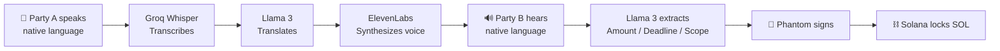
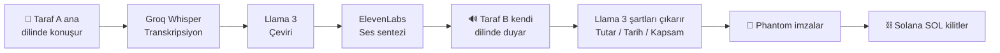

<div align="center">

# 🎙️ VoiceArbiter

### *Speak. Agree. Settle. — In Any Language, On-Chain.*

**A real-time, AI-powered multilingual voice negotiation platform that automatically extracts deal terms and executes trustless Solana escrow contracts.**

[](https://solana.com/)
[](https://nextjs.org/)
[](https://react.dev/)
[](https://tailwindcss.com/)
[](https://groq.com/)
[](https://elevenlabs.io/)

### 🌐 [**▶️ TRY THE LIVE DEMO**](https://voice-arbiter-j68y.vercel.app/) 🌐

📖 [English](#-english-version) • 🇹🇷 [Türkçe](#-türkçe-versiyon)

---

</div>

# 🇬🇧 English Version

## 🎬 Live Demo

> **🚀 Experience VoiceArbiter live:** [**voice-arbiter-j68y.vercel.app**](https://voice-arbiter-j68y.vercel.app/)
>
> **Try it in 3 steps:**
> 1. 👻 Make sure you have the [Phantom Wallet](https://phantom.app/) browser extension installed and switched to **Solana Devnet**.
> 2. 💧 Get free test SOL from a [Devnet Faucet](https://faucet.solana.com/).
> 3. 🔗 Open the [demo link](https://voice-arbiter-j68y.vercel.app/), connect your wallet, and start negotiating in your native language!
>
> 💡 *Tip: For the best demo experience, allow microphone access and try negotiating in two different languages (e.g., Turkish ↔ English) to see the real-time AI translation in action.*

---

## 🌍 The Problem

> Global freelancing and digital trade are exploding — but two friction points still cripple cross-border deals:
>
> 1. **🗣️ Language Barriers** — Misunderstandings in negotiations cost trust, time, and money.
> 2. **🤝 Lack of Payment Guarantees** — Freelancers fear non-payment; clients fear non-delivery.
>
> Existing escrow platforms are slow, expensive, centralized, and require tedious manual form-filling. **VoiceArbiter** removes all of it.

---

## 💡 The Solution

VoiceArbiter lets two parties **speak naturally in their own languages**, while AI listens, translates, and — once both sides verbally agree — **locks the funds on Solana in seconds**. No forms. No middlemen. No language barriers.

```
🎤 Speak  →  🧠 AI Translates  →  📝 LLM Extracts Terms  →  ⛓️ Solana Locks Funds
```

---

## 🚀 Features

| Feature | Description |
| :--- | :--- |
| 🌐 **Real-Time Multilingual Voice** | Parties speak in their native language. Groq's **Whisper** transcribes, **Llama 3** translates, and **ElevenLabs** synthesizes natural speech in the listener's language — all in real-time. |
| 🤖 **AI-Powered Term Extraction** | No forms. **Llama 3** continuously analyzes the conversation and extracts the final agreement terms — `Amount (SOL)`, `Deadline`, and `Scope of Work` — automatically. |
| ⛓️ **Trustless Solana Escrow** | Once both parties verbally confirm, terms are bound to a Solana transaction. Funds are instantly locked via `@solana/web3.js` and signed by the **Phantom Wallet**. |
| 👻 **Phantom Wallet Integration** | Seamless one-click wallet connection. Users sign and approve the on-chain transaction without ever leaving the negotiation. |
| ⚡ **Low-Latency by Design** | Powered by Groq's LPU inference — voice-to-voice translation feels instantaneous, preserving the natural flow of negotiation. |
| 🧠 **Context-Aware Memory** | The LLM tracks the entire conversation, so terms can be revised, refined, and finalized organically — just like a real human negotiation. |

---

## 🛠 Tech Stack

### 🎨 Frontend
| Tech | Role |
| :--- | :--- |
| **Next.js 14** | App Router, Server Actions, API routes |
| **React 18** | Component architecture |
| **Tailwind CSS** | Utility-first styling |
| **Zustand** | Lightweight global state for conversation & wallet |

### ⛓️ Web3
| Tech | Role |
| :--- | :--- |
| **@solana/web3.js** | Building & sending Solana transactions |
| **Phantom Wallet Adapter** | Wallet connection & transaction signing |
| **Solana Devnet/Mainnet** | Settlement layer |

### 🧠 AI Layer
| Tech | Role |
| :--- | :--- |
| **Groq — Whisper API** | Ultra-fast speech-to-text transcription |
| **Groq — Llama 3** | Translation + structured term extraction |
| **ElevenLabs API** | Natural multilingual text-to-speech synthesis |

---

## ⚙️ How It Works

A complete VoiceArbiter negotiation in **6 steps**:



### Step-by-Step User Flow

1. **🔗 Connect Wallet** — The client connects their Phantom wallet. The freelancer's public key is preconfigured.
2. **🎙️ Start Voice Session** — Both parties join a session and select their preferred language.
3. **🗣️ Negotiate Naturally** — Each party speaks in their own tongue. Within ~1 second, the other party hears it spoken in *their* language by ElevenLabs.
4. **📝 Live Term Extraction** — As the conversation evolves, Llama 3 maintains a structured JSON of the deal: `{ amountSOL, deadline, scope }`. The UI shows it updating live.
5. **✅ Verbal Confirmation** — When both parties say "I agree" (in any language), the LLM detects mutual consent and surfaces a **Confirm & Lock Funds** button.
6. **⛓️ On-Chain Settlement** — The client signs via Phantom. `@solana/web3.js` builds and submits the transaction, locking the SOL until the deadline or delivery condition is met.

---

## 💻 Installation & Setup

### 📋 Prerequisites
- Node.js **≥ 18.x**
- npm / yarn / pnpm
- A [Phantom Wallet](https://phantom.app/) browser extension
- API keys from [Groq](https://console.groq.com/) and [ElevenLabs](https://elevenlabs.io/)

### 1️⃣ Clone the Repository
```bash
git clone https://github.com/your-username/voice-arbiter.git
cd voice-arbiter
```

### 2️⃣ Install Dependencies
```bash
npm install
```

### 3️⃣ Configure Environment Variables

Create a `.env.local` file in the project root:

```bash
touch .env.local
```

Add the following variables:

```env
# 🌐 Solana RPC endpoint (Devnet recommended for testing)
NEXT_PUBLIC_SOLANA_RPC=https://api.devnet.solana.com

# 👤 Public key of the freelancer (recipient of the escrow)
NEXT_PUBLIC_FREELANCER_PUBKEY=YourFreelancerSolanaPublicKeyHere

# 🧠 Groq API key (for Whisper + Llama 3)
GROQ_API_KEY=your_groq_api_key_here

# 🔊 ElevenLabs API key (for multilingual TTS)
ELEVENLABS_API_KEY=your_elevenlabs_api_key_here
```

> ⚠️ **Never commit `.env.local`.** Make sure it is listed in your `.gitignore`.

### 4️⃣ Run the Development Server
```bash
npm run dev
```

Open [http://localhost:3000](http://localhost:3000) in your browser. 🎉

### 5️⃣ Build for Production
```bash
npm run build
npm start
```

---

## 🗺️ Roadmap

- [ ] On-chain dispute resolution via DAO arbitration
- [ ] Support for SPL tokens (USDC, USDT) in addition to SOL
- [ ] Mobile-first PWA with native microphone integration
- [ ] Voice biometrics for additional identity verification
- [ ] Multi-party (3+) negotiation rooms

---

## 🤝 Contributing

Contributions, issues, and feature requests are welcome! Feel free to check the [issues page](#).

1. Fork the project
2. Create your feature branch (`git checkout -b feature/AmazingFeature`)
3. Commit your changes (`git commit -m 'Add some AmazingFeature'`)
4. Push to the branch (`git push origin feature/AmazingFeature`)
5. Open a Pull Request

---

## 📜 License & Hackathon Disclaimer

This project is licensed under the **MIT License** — see the [LICENSE](LICENSE) file for details.

> ⚠️ **Hackathon Disclaimer:** VoiceArbiter was built as a hackathon prototype to demonstrate the convergence of real-time AI and Solana smart contracts. It is **not audited**, **not production-ready**, and **should not be used to handle real funds** without a thorough security review. Use Devnet for all testing. The authors assume no liability for any loss of funds.

---

<div align="center">

### Built with ❤️, ☕, and a lot of `console.log()` during a sleepless hackathon weekend.

**If VoiceArbiter helped you, drop a ⭐ on the repo!**

</div>

---
---

<div align="center">

# 🇹🇷 Türkçe Versiyon

### *Konuş. Anlaş. Öde. — Hangi Dilde Olursa Olsun, Zincir Üzerinde.*

**Müzakere terimlerini otomatik olarak çıkaran ve güvensiz Solana escrow sözleşmelerini yürüten gerçek zamanlı, AI destekli çok dilli sesli müzakere platformu.**

</div>

## 🎬 Canlı Demo

> **🚀 VoiceArbiter'ı canlı deneyimleyin:** [**voice-arbiter-j68y.vercel.app**](https://voice-arbiter-j68y.vercel.app/)
>
> **3 adımda deneyin:**
> 1. 👻 [Phantom Wallet](https://phantom.app/) tarayıcı eklentisinin kurulu olduğundan ve **Solana Devnet**'e geçtiğinizden emin olun.
> 2. 💧 [Devnet Faucet](https://faucet.solana.com/) üzerinden ücretsiz test SOL alın.
> 3. 🔗 [Demo linkini](https://voice-arbiter-j68y.vercel.app/) açın, cüzdanınızı bağlayın ve kendi ana dilinizde müzakereye başlayın!
>
> 💡 *İpucu: En iyi demo deneyimi için mikrofon erişimine izin verin ve gerçek zamanlı AI çevirisini görmek için iki farklı dilde (örn. Türkçe ↔ İngilizce) müzakere etmeyi deneyin.*

---

## 🌍 Problem

> Global freelance ve dijital ticaret patlama yaşıyor — ancak iki sürtünme noktası sınır ötesi anlaşmaları hâlâ sekteye uğratıyor:
>
> 1. **🗣️ Dil Bariyerleri** — Müzakerelerdeki yanlış anlaşılmalar güvene, zamana ve paraya mal oluyor.
> 2. **🤝 Ödeme Garantisinin Olmaması** — Freelancer'lar ödememe korkusu yaşıyor; müşteriler teslim edilmeme korkusu yaşıyor.
>
> Mevcut escrow platformları yavaş, pahalı, merkezi ve sıkıcı manuel form doldurma gerektiriyor. **VoiceArbiter** tüm bunları ortadan kaldırıyor.

---

## 💡 Çözüm

VoiceArbiter, iki tarafın **kendi dillerinde doğal bir şekilde konuşmasına** olanak tanır, bu sırada AI dinler, çevirir ve — her iki taraf sözlü olarak anlaştığında — **fonları saniyeler içinde Solana üzerinde kilitler**. Form yok. Aracı yok. Dil bariyeri yok.

```
🎤 Konuş  →  🧠 AI Çevirir  →  📝 LLM Şartları Çıkarır  →  ⛓️ Solana Fonları Kilitler
```

---

## 🚀 Özellikler

| Özellik | Açıklama |
| :--- | :--- |
| 🌐 **Gerçek Zamanlı Çok Dilli Ses** | Taraflar ana dillerinde konuşur. Groq'un **Whisper** modeli transkripsiyon yapar, **Llama 3** çevirir ve **ElevenLabs** dinleyicinin dilinde doğal konuşma sentezler — hepsi gerçek zamanlı. |
| 🤖 **AI Destekli Şart Çıkarma** | Form yok. **Llama 3** konuşmayı sürekli analiz eder ve nihai anlaşma şartlarını — `Tutar (SOL)`, `Son Tarih` ve `İş Kapsamı` — otomatik olarak çıkarır. |
| ⛓️ **Güvensiz Solana Escrow** | Her iki taraf sözlü olarak onayladığında, şartlar bir Solana işlemine bağlanır. Fonlar `@solana/web3.js` aracılığıyla anında kilitlenir ve **Phantom Wallet** ile imzalanır. |
| 👻 **Phantom Wallet Entegrasyonu** | Sorunsuz tek tıkla cüzdan bağlantısı. Kullanıcılar müzakereden ayrılmadan zincir üstü işlemi imzalar ve onaylar. |
| ⚡ **Düşük Gecikme Tasarımı** | Groq'un LPU inference altyapısıyla — sesten-sese çeviri anlık hissedilir, müzakerenin doğal akışını korur. |
| 🧠 **Bağlamsal Hafıza** | LLM tüm konuşmayı takip eder, böylece şartlar gerçek bir insan müzakeresi gibi organik olarak revize edilip, rafine edilip, sonuçlandırılabilir. |

---

## 🛠 Teknoloji Yığını

### 🎨 Frontend
| Teknoloji | Rolü |
| :--- | :--- |
| **Next.js 14** | App Router, Server Actions, API route'ları |
| **React 18** | Bileşen mimarisi |
| **Tailwind CSS** | Utility-first stillendirme |
| **Zustand** | Konuşma ve cüzdan için hafif global state yönetimi |

### ⛓️ Web3
| Teknoloji | Rolü |
| :--- | :--- |
| **@solana/web3.js** | Solana işlemlerini oluşturma ve gönderme |
| **Phantom Wallet Adapter** | Cüzdan bağlantısı ve işlem imzalama |
| **Solana Devnet/Mainnet** | Ödeme katmanı |

### 🧠 AI Katmanı
| Teknoloji | Rolü |
| :--- | :--- |
| **Groq — Whisper API** | Ultra hızlı konuşmadan-metne dönüştürme |
| **Groq — Llama 3** | Çeviri + yapısal şart çıkarma |
| **ElevenLabs API** | Doğal çok dilli metinden-konuşmaya sentezleme |

---

## ⚙️ Nasıl Çalışır?

Tam bir VoiceArbiter müzakeresi **6 adımda**:



### Adım Adım Kullanıcı Akışı

1. **🔗 Cüzdan Bağlayın** — Müşteri Phantom cüzdanını bağlar. Freelancer'ın public key'i önceden tanımlıdır.
2. **🎙️ Sesli Oturum Başlatın** — Her iki taraf da bir oturuma katılır ve tercih ettiği dili seçer.
3. **🗣️ Doğal Konuşun** — Her taraf kendi dilinde konuşur. Yaklaşık 1 saniye içinde, diğer taraf bunu *kendi* dilinde ElevenLabs sesinden duyar.
4. **📝 Canlı Şart Çıkarımı** — Konuşma ilerledikçe, Llama 3 anlaşmanın yapısal JSON halini günceller: `{ amountSOL, deadline, scope }`. Arayüz bunu canlı gösterir.
5. **✅ Sözlü Onay** — Her iki taraf da "kabul ediyorum" dediğinde (hangi dilde olursa olsun), LLM karşılıklı rızayı algılar ve **Onayla ve Fonları Kilitle** butonunu çıkarır.
6. **⛓️ Zincir Üstü Anlaşma** — Müşteri Phantom üzerinden imzalar. `@solana/web3.js` işlemi oluşturup gönderir, SOL son tarih veya teslimat koşuluna kadar kilitlenir.

---

## 💻 Kurulum & Çalıştırma

### 📋 Gereksinimler
- Node.js **≥ 18.x**
- npm / yarn / pnpm
- [Phantom Wallet](https://phantom.app/) tarayıcı eklentisi
- [Groq](https://console.groq.com/) ve [ElevenLabs](https://elevenlabs.io/) API anahtarları

### 1️⃣ Depoyu Klonlayın
```bash
git clone https://github.com/your-username/voice-arbiter.git
cd voice-arbiter
```

### 2️⃣ Bağımlılıkları Yükleyin
```bash
npm install
```

### 3️⃣ Ortam Değişkenlerini Yapılandırın

Proje kök dizininde bir `.env.local` dosyası oluşturun:

```bash
touch .env.local
```

Aşağıdaki değişkenleri ekleyin:

```env
# 🌐 Solana RPC endpoint (Test için Devnet önerilir)
NEXT_PUBLIC_SOLANA_RPC=https://api.devnet.solana.com

# 👤 Freelancer'ın public key'i (escrow alıcısı)
NEXT_PUBLIC_FREELANCER_PUBKEY=BurayaFreelancerSolanaPublicKey

# 🧠 Groq API anahtarı (Whisper + Llama 3 için)
GROQ_API_KEY=buraya_groq_api_anahtariniz

# 🔊 ElevenLabs API anahtarı (çok dilli TTS için)
ELEVENLABS_API_KEY=buraya_elevenlabs_api_anahtariniz
```

> ⚠️ **`.env.local` dosyasını asla commit etmeyin.** `.gitignore` dosyanızda listelendiğinden emin olun.

### 4️⃣ Geliştirme Sunucusunu Çalıştırın
```bash
npm run dev
```

Tarayıcınızda [http://localhost:3000](http://localhost:3000) adresini açın. 🎉

### 5️⃣ Production Build
```bash
npm run build
npm start
```

---

## 🗺️ Yol Haritası

- [ ] DAO tahkimi ile zincir üstü uyuşmazlık çözümü
- [ ] SOL'a ek olarak SPL token desteği (USDC, USDT)
- [ ] Native mikrofon entegrasyonlu mobile-first PWA
- [ ] Ek kimlik doğrulama için ses biyometrisi
- [ ] Çok taraflı (3+) müzakere odaları

---

## 🤝 Katkıda Bulunma

Katkılar, sorunlar ve özellik istekleri memnuniyetle karşılanır! [Issues sayfasını](#) kontrol etmekten çekinmeyin.

1. Projeyi fork'layın
2. Feature branch'inizi oluşturun (`git checkout -b feature/HarikaOzellik`)
3. Değişikliklerinizi commit'leyin (`git commit -m 'Harika bir özellik eklendi'`)
4. Branch'inizi push'layın (`git push origin feature/HarikaOzellik`)
5. Bir Pull Request açın

---

## 📜 Lisans & Hackathon Sorumluluk Reddi

Bu proje **MIT Lisansı** altında lisanslanmıştır — detaylar için [LICENSE](LICENSE) dosyasına bakın.

> ⚠️ **Hackathon Sorumluluk Reddi:** VoiceArbiter, gerçek zamanlı AI ile Solana akıllı sözleşmelerinin birleşimini göstermek için bir hackathon prototipi olarak geliştirilmiştir. **Denetlenmemiştir**, **production-ready değildir** ve kapsamlı bir güvenlik incelemesi yapılmadan **gerçek fonları yönetmek için kullanılmamalıdır**. Tüm testler için Devnet kullanın. Yazarlar herhangi bir fon kaybından sorumlu değildir.

---

<div align="center">

### Uykusuz bir hackathon haftasonunda ❤️, ☕ ve bolca `console.log()` ile geliştirildi.

**VoiceArbiter işinize yaradıysa, repo'ya bir ⭐ bırakın!**

</div>